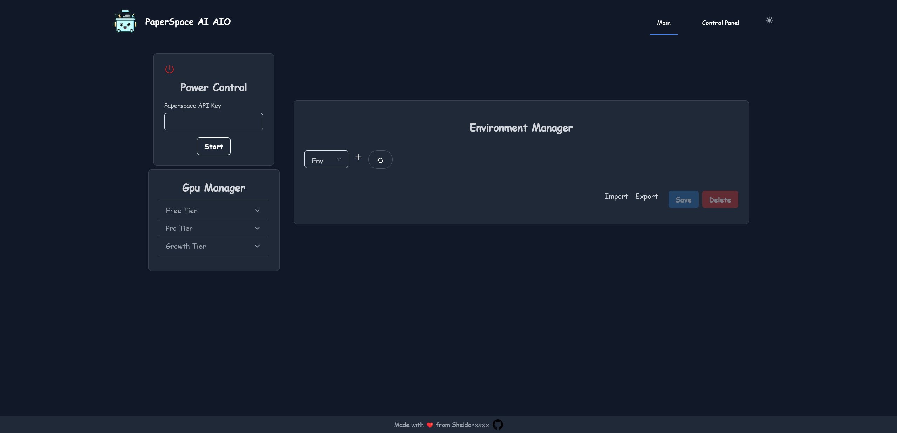

<div align="center">
<h1> Paperspace AI AIO </h1>

[](https://app.netlify.com/sites/clinquant-licorice-965aa0/deploys) [](https://dl.circleci.com/status-badge/redirect/gh/sheldonchiu/PaperSpace-AI-AIO/tree/main) [](https://opensource.org/licenses/MIT)

**Ultimate AI Toolbox for Paperpsace Gradient**
<div align="left">

## 🎯 Main Features
<font size="4">

1. 🚀 Hassle-Free Setup for Popular AI Tools - Diffusion, LLM, and More! 
2. 📱Mobile Friendly Web UI for Easy Access to Your AI Tools from Anywhere
3. 🛠️Comprehensive Set of Uitlity Tools to Supercharge Your AI Workflow

🌐 Demo: <a>https://ai.sheldonxxxx.cc</a>
</font>

<figure>
    
    <figcaption align = "center"><b>Home Page</b></figcaption>
</figure>

## Avilable Tools

|Image generation|Large Language Model|Utility|
|---|---|---|
|[Stable Diffusion web UI](https://github.com/AUTOMATIC1111/stable-diffusion-webui)👍|[Text Generation WebUI](https://github.com/oobabooga/text-generation-webui)👍|[A Standalone Image browser](https://github.com/zanllp/sd-webui-infinite-image-browsing.git)|
|[Stable Diffusion Comfy](https://github.com/comfyanonymous/ComfyUI)👍|[FastChat](https://github.com/lm-sys/FastChat)|Command Server to execute command using REST API|
|[Stable Diffusion Volta ](https://github.com/VoltaML/voltaML-fast-stable-diffusion)|[Langflow👍](https://github.com/logspace-ai/langflow)|Model Downloader (support Huggingface, Civitai, URL)|
| |[Flowise](https://github.com/FlowiseAI/Flowise)|Remote access the tools using direct URL|
| | |Sync files to Minio S3  |
| | |Web File Browser |
| | |Discord Notification |


## 🚀 Getting Started
### 🐍 Installation via Python package manager
```bash
pip install -r requirements.txt
reflex init
reflex run --env prod
```

### 📦 Installation via pre-built Docker container
```bash
docker run -p3000:3000 -p 8000:8000 sheldonxxxx/paperspace-ai-aio:latest
```
Visit http://localhost:3000 to access the web UI.

## User Guide
<a>https://www.sheldonxxxx.cc/ai/meet-the-ultimate-ai-toolbox-for-gradient/</a>

## Development Guide
🚧 Coming soon

## Contributing
If you have an idea for a new feature or have found a bug, please open an issue or submit a pull request **to the dev branch**
